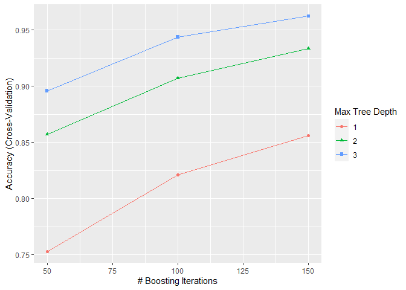
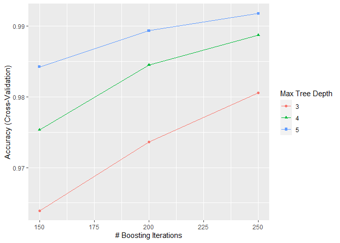

# Introduction

One thing that people regularly do is quantify how much of a particular activity they do, but they rarely quantify how well they do it.
In this project, our goal is to use data from accelerometers on the belt, forearm, arm, and dumbbell of 6 participants to achieve this goal.
They were asked to perform barbell lifts correctly and incorrectly in 5 different ways:

* exactly according to the specification (Class A),
* throwing the elbows to the front (Class B),
* lifting the dumbbell only halfway (Class C),
* lowering the dumbbell only halfway (Class D), and
* throwing the hips to the front (Class E).

We download the data, clean the data, choose a model and estimate the expected out of sample error, train the chosen model, and apply the model to a testing data set.

# Getting the Data

We load the libraries we want to use.


```r
library(tidyverse)
```

```
## -- Attaching packages --------------------------------------- tidyverse 1.3.1 --
```

```
## v ggplot2 3.3.5     v purrr   0.3.4
## v tibble  3.1.4     v dplyr   1.0.7
## v tidyr   1.1.4     v stringr 1.4.0
## v readr   2.0.2     v forcats 0.5.1
```

```
## Warning: Paket 'tibble' wurde unter R Version 4.1.1 erstellt
```

```
## Warning: Paket 'tidyr' wurde unter R Version 4.1.1 erstellt
```

```
## Warning: Paket 'readr' wurde unter R Version 4.1.1 erstellt
```

```
## -- Conflicts ------------------------------------------ tidyverse_conflicts() --
## x dplyr::filter() masks stats::filter()
## x dplyr::lag()    masks stats::lag()
```

```r
library(caret)
```

```
## Warning: Paket 'caret' wurde unter R Version 4.1.1 erstellt
```

```
## Lade nötiges Paket: lattice
```

```
## 
## Attache Paket: 'caret'
```

```
## Das folgende Objekt ist maskiert 'package:purrr':
## 
##     lift
```

We download the CSV files using the provided URLs.


```r
training.url <- "https://d396qusza40orc.cloudfront.net/predmachlearn/pml-training.csv"
testing.url <- "https://d396qusza40orc.cloudfront.net/predmachlearn/pml-testing.csv"
if(!file.exists("training.csv")) download.file(training.url, "training.csv")
if(!file.exists("testing.csv")) download.file(testing.url, "testing.csv")
```

We read the training and the testing data set.


```r
training <- read_csv("training.csv", na = c("", "NA", "#DIV/0!"))
```

```
## New names:
## * `` -> ...1
```

```
## Rows: 19622 Columns: 160
```

```
## -- Column specification --------------------------------------------------------
## Delimiter: ","
## chr   (4): user_name, cvtd_timestamp, new_window, classe
## dbl (150): ...1, raw_timestamp_part_1, raw_timestamp_part_2, num_window, rol...
## lgl   (6): kurtosis_yaw_belt, skewness_yaw_belt, kurtosis_yaw_dumbbell, skew...
```

```
## 
## i Use `spec()` to retrieve the full column specification for this data.
## i Specify the column types or set `show_col_types = FALSE` to quiet this message.
```

```r
testing <- read_csv("testing.csv", na = c("", "NA", "#DIV/0!"))
```

```
## New names:
## * `` -> ...1
```

```
## Rows: 20 Columns: 160
```

```
## -- Column specification --------------------------------------------------------
## Delimiter: ","
## chr   (3): user_name, cvtd_timestamp, new_window
## dbl  (57): ...1, raw_timestamp_part_1, raw_timestamp_part_2, num_window, rol...
## lgl (100): kurtosis_roll_belt, kurtosis_picth_belt, kurtosis_yaw_belt, skewn...
```

```
## 
## i Use `spec()` to retrieve the full column specification for this data.
## i Specify the column types or set `show_col_types = FALSE` to quiet this message.
```

# Cleaning the Data

First, we improve the column names.
We name the first, unnamed column "index".
We correct some typos ("picth" to "pitch", "classe" to "class").
We correct some inconsistent names ("skewness_roll_belt.1" to "skewness_pitch_belt", "var_accel" to "var_total_accel").


```r
improve.names <- function(names) {
    names <- str_replace(names, "...1", "index")
    names <- str_replace(names, "picth", "pitch")
    names <- str_replace(names, "skewness_roll_belt.1", "skewness_pitch_belt")
    names <- str_replace(names, "var_accel", "var_total_accel")
}

names(training) <- improve.names(names(training))
names(training) <- str_replace(names(training), "classe", "class")

names(testing) <- improve.names(names(testing))
```

We transform the column "class" in the training data set into a factor variable.


```r
training <- training %>% mutate(class = factor(class))
```

We decided to base our prediction model on the raw measurements.
Hence, we remove all unneeded columns.
We remove the column "index", since it simply numbers the observations from 1 to n.
We remove the column "user_name", since we do not want to use it as a predictor.
We remove the columns containing "timestamp", since we assume that time has no influence on the measurements.

We remove the columns containing "window", since we decided not to use the aggregated features of multiple consecutive measurements.
We remove all columns containing these aggregated features:
There are 96 features resulting from every combination of the Euler angles (yaw, pitch, roll), the sensors (belt, arm, dumbbell, forearm), and the aggregation methods (mean, variance, standard deviation, max, min, amplitude, kurtosis, skewness).
There are 4 additional features for the variance of the total acceleration of each sensor (belt, arm, dumbbell, forearm).
For the testing set we also remove the column "problem_id".


```r
remove.columns <- function(data.frame) {
    data.frame %>%
        select(!matches("index")) %>%         # removes  1 column
        select(!matches("user_name")) %>%     # removes  1 column
        select(!contains("timestamp")) %>%    # removes  3 columns
        select(!contains("window")) %>%       # removes  2 columns
        select(!starts_with("avg")) %>%       # removes 12 columns
        select(!starts_with("var")) %>%       # removes 16 columns
        select(!starts_with("stddev")) %>%    # removes 12 columns
        select(!starts_with("max")) %>%       # removes 12 columns
        select(!starts_with("min")) %>%       # removes 12 columns
        select(!starts_with("amplitude")) %>% # removes 12 columns
        select(!starts_with("kurtosis")) %>%  # removes 12 columns
        select(!starts_with("skewness"))      # removes 12 columns
}

training <- remove.columns(training)

testing <- remove.columns(testing)
testing <- testing %>%
    select(!matches("problem_id"))            # removes  1 column
```

# Choosing, Training, and Tuning a Model

We decided to use the model Stochastic Gradient Boosting.
To check if the model performs well, we use 10-fold cross validation.


```r
trControl <- trainControl(method = "cv", number = 10)
set.seed(1)
fit.1 <- train(class ~ ., training, method = "gbm", verbose = FALSE, trControl = trControl)
print(fit.1)
```

```
## Stochastic Gradient Boosting 
## 
## 19622 samples
##    52 predictor
##     5 classes: 'A', 'B', 'C', 'D', 'E' 
## 
## No pre-processing
## Resampling: Cross-Validated (10 fold) 
## Summary of sample sizes: 17658, 17660, 17660, 17660, 17659, 17661, ... 
## Resampling results across tuning parameters:
## 
##   interaction.depth  n.trees  Accuracy   Kappa    
##   1                   50      0.7530814  0.6869372
##   1                  100      0.8212718  0.7737789
##   1                  150      0.8557733  0.8174646
##   2                   50      0.8570981  0.8188909
##   2                  100      0.9071439  0.8824949
##   2                  150      0.9333383  0.9156439
##   3                   50      0.8957784  0.8680525
##   3                  100      0.9436838  0.9287358
##   3                  150      0.9623370  0.9523480
## 
## Tuning parameter 'shrinkage' was held constant at a value of 0.1
## 
## Tuning parameter 'n.minobsinnode' was held constant at a value of 10
## Accuracy was used to select the optimal model using the largest value.
## The final values used for the model were n.trees = 150, interaction.depth =
##  3, shrinkage = 0.1 and n.minobsinnode = 10.
```

Hence, the expected out of sample error of the best model is 0.962337.

The following plot shows the cross-validation accuracy as a function of the number of trees for the different interaction depths.


```r
ggplot(fit.1)
```

<!-- -->

Both, a higher number of trees and a higher interaction depth increase the cross-validation accuracy.
Hence, we check if increasing these parameters further is beneficial.


```r
trControl <- trainControl(method = "cv", number = 10)
tuneGrid <- expand.grid(n.trees = c(150, 200, 250),
                        interaction.depth = c(3, 4, 5),
                        shrinkage = c(.1),
                        n.minobsinnode = c(10))
set.seed(1)
fit.2 <- train(class ~ ., training, method = "gbm", verbose = FALSE, trControl = trControl, tuneGrid = tuneGrid)
print(fit.2)
```

```
## Stochastic Gradient Boosting 
## 
## 19622 samples
##    52 predictor
##     5 classes: 'A', 'B', 'C', 'D', 'E' 
## 
## No pre-processing
## Resampling: Cross-Validated (10 fold) 
## Summary of sample sizes: 17658, 17660, 17660, 17660, 17659, 17661, ... 
## Resampling results across tuning parameters:
## 
##   interaction.depth  n.trees  Accuracy   Kappa    
##   3                  150      0.9639174  0.9543498
##   3                  200      0.9736515  0.9666672
##   3                  250      0.9805827  0.9754370
##   4                  150      0.9753333  0.9687944
##   4                  200      0.9845070  0.9804016
##   4                  250      0.9887372  0.9857532
##   5                  150      0.9842522  0.9800786
##   5                  200      0.9893486  0.9865265
##   5                  250      0.9917946  0.9896207
## 
## Tuning parameter 'shrinkage' was held constant at a value of 0.1
## 
## Tuning parameter 'n.minobsinnode' was held constant at a value of 10
## Accuracy was used to select the optimal model using the largest value.
## The final values used for the model were n.trees = 250, interaction.depth =
##  5, shrinkage = 0.1 and n.minobsinnode = 10.
```

Now, the expected out of sample error of the best model is 0.9917946.

We have another look at the cross-validation accuracy as a function of the number of trees for the different interaction depths.


```r
ggplot(fit.2)
```

<!-- -->

Even though there seems to be room for further improvement, we content with the best tuning parameters found so far.

# Training the Final Model

We train the final model on the whole training data set using the best tuning parameters from the last training.


```r
set.seed(1)
fit.3 <- train(class ~ ., training, method = "gbm", tuneGrid = fit.2$bestTune, verbose = FALSE)
```

We have a look at the confusion matrix.


```r
cm <- confusionMatrix(predict(fit.3, training), training$class)
cm
```

```
## Confusion Matrix and Statistics
## 
##           Reference
## Prediction    A    B    C    D    E
##          A 5580    4    0    0    0
##          B    0 3792    5    0    0
##          C    0    1 3414    4    0
##          D    0    0    3 3211    3
##          E    0    0    0    1 3604
## 
## Overall Statistics
##                                           
##                Accuracy : 0.9989          
##                  95% CI : (0.9984, 0.9993)
##     No Information Rate : 0.2844          
##     P-Value [Acc > NIR] : < 2.2e-16       
##                                           
##                   Kappa : 0.9986          
##                                           
##  Mcnemar's Test P-Value : NA              
## 
## Statistics by Class:
## 
##                      Class: A Class: B Class: C Class: D Class: E
## Sensitivity            1.0000   0.9987   0.9977   0.9984   0.9992
## Specificity            0.9997   0.9997   0.9997   0.9996   0.9999
## Pos Pred Value         0.9993   0.9987   0.9985   0.9981   0.9997
## Neg Pred Value         1.0000   0.9997   0.9995   0.9997   0.9998
## Prevalence             0.2844   0.1935   0.1744   0.1639   0.1838
## Detection Rate         0.2844   0.1933   0.1740   0.1636   0.1837
## Detection Prevalence   0.2846   0.1935   0.1742   0.1639   0.1837
## Balanced Accuracy      0.9999   0.9992   0.9987   0.9990   0.9996
```

The overall accuracy is 0.9989298.

# Testing the Final Model

We use the final model to predict the classes of the observations in the testing data set.


```r
predict(fit.3, testing)
```

```
##  [1] B A B A A E D B A A B C B A E E A B B B
## Levels: A B C D E
```
